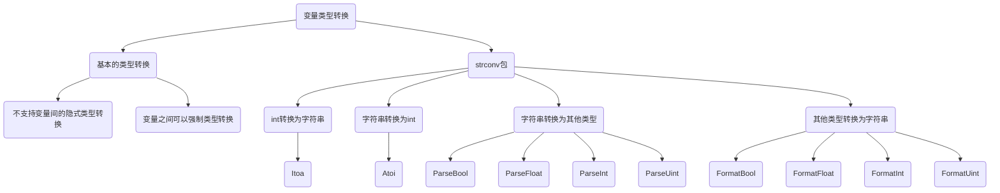

[TOC]

## 变量类型转换

```mermaid
graph TD
    A(变量类型转换)-->B1(基本的类型转换)
    B1-->C1(不支持变量间的隐式类型转换)
    B1-->C2(变量之间可以强制类型转换)
    
    A-->B2(strconv包)
    B2-->C3(int转换为字符串)
    C3-->D1(Itoa)
    B2-->C4(字符串转换为int)
    C4-->D2(Atoi)
    
    B2-->C5(字符串转换为其他类型)
    C5-->D3(ParseBool)
    C5-->D4(ParseFloat)
    C5-->D5(ParseInt)
    C5-->D6(ParseUint)
    
    B2-->C6(其他类型转换为字符串)
    C6-->D7(FormatBool)
    C6-->D8(FormatFloat)
    C6-->D9(FormatInt)
    C6-->D10(FormatUint)
```

